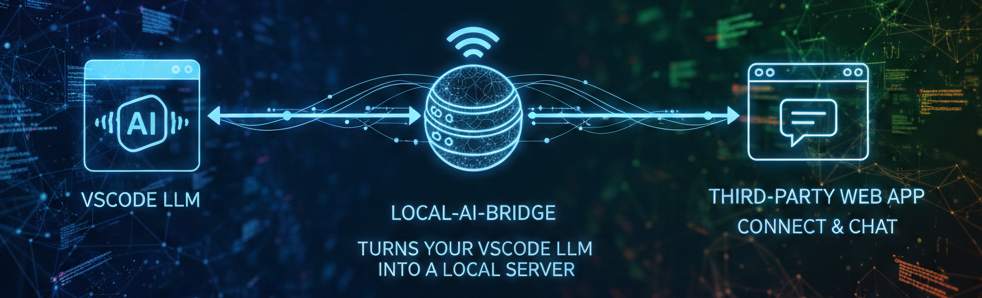
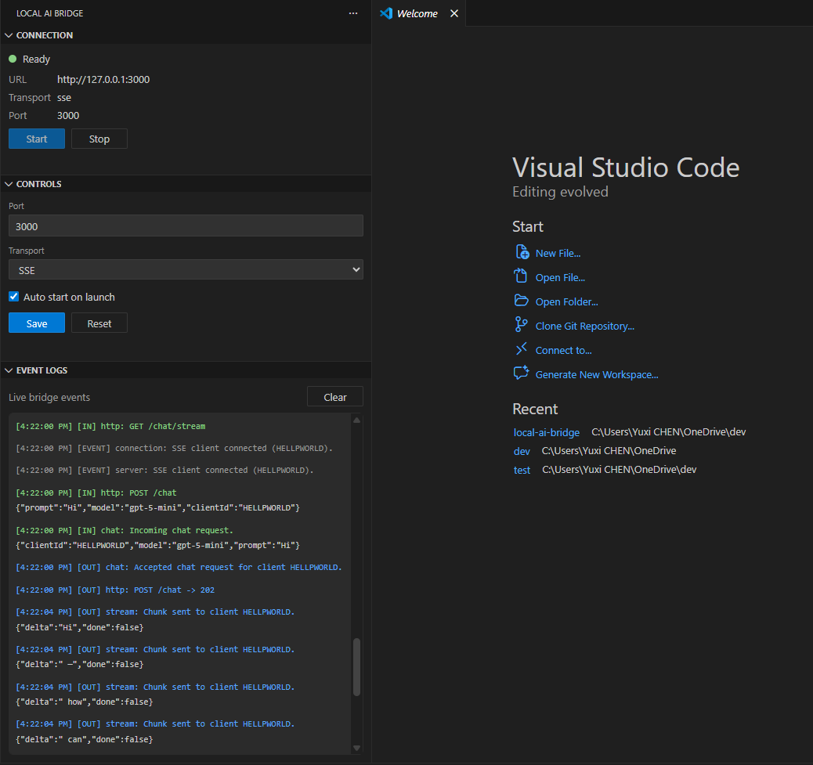
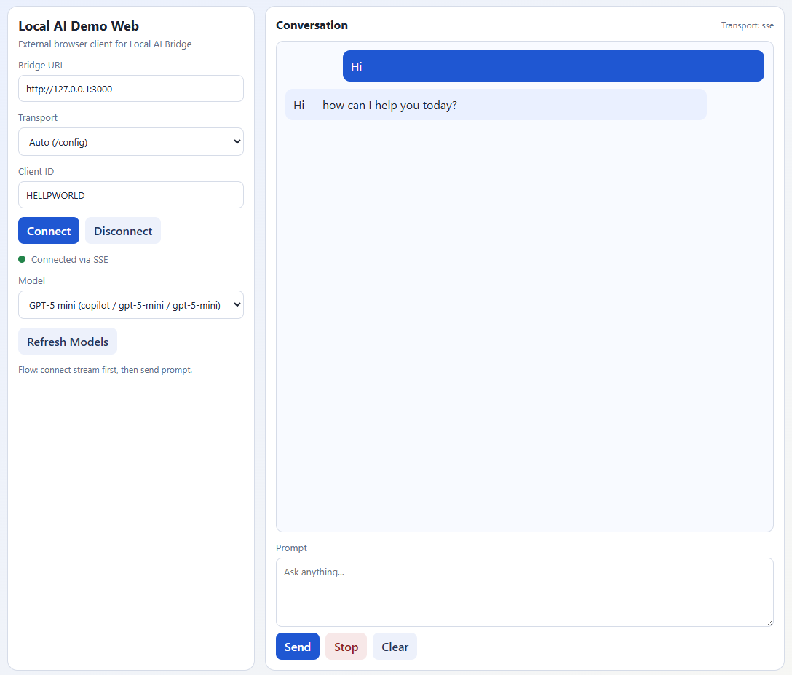

# Local AI Bridge (VS Code Extension)

Local AI Bridge runs a localhost server inside VS Code and exposes chat-capable `vscode.lm` models through:

- HTTP/WebSocket endpoints for local clients
- streamed responses (SSE or WebSocket)
- a built-in browser chat UI at `http://127.0.0.1:<port>/`

The bridge is provider-agnostic. It discovers models via `vscode.lm.selectChatModels()` and does not hardcode model vendors.

## Who Is This For?

- Developers who want a local bridge between VS Code `vscode.lm` models and external clients
- Teams validating chat integration behavior (streaming, stop/cancel, connection lifecycle)
- Developers testing OpenAI-ready apps against local model providers with a thin adapter layer

### Compatibility Note

Local AI Bridge exposes a custom bridge API (`/chat`, `/models`, `/chat/stream`, `/chat/ws`), not a full OpenAI API clone. If your app expects OpenAI endpoints directly, add an adapter/proxy layer.

## Highlights

- Binds to `127.0.0.1` only (never `0.0.0.0`)
- Activity Bar integration with a dedicated **Local AI Bridge** icon
- Native collapsible sidebar sections:
  - `Connection` (status + Start/Stop)
  - `Controls` (port/transport/autoStart + Save/Reset)
  - `Event Logs` (live bridge events)
- Command Palette support:
  - `Local AI: Start Server`
  - `Local AI: Stop Server`
- Streaming transport modes:
  - SSE (`/chat/stream`)
  - WebSocket (`/chat/ws`)
- Built-in UI + standalone external demo web app

## Screenshots

### Extension Sidebar



### Demo Web Client



## Requirements

- VS Code `^1.95.0`
- Node.js 18+ (recommended for local build)
- At least one VS Code extension that exposes models through `vscode.lm`

## Install as a VS Code Extension

### Option 1: Development Host (fastest)

1. Open this project in VS Code.
2. Run:
   ```bash
   npm install
   npm run compile
   ```
3. Press `F5` to launch an Extension Development Host window.
4. In the host window, click the **Local AI Bridge** icon in the Activity Bar.

### Option 2: Package + install VSIX

1. Build and package:
   ```bash
   npm install
   npm run compile
   npx @vscode/vsce package
   ```
2. Install:
   - Command Palette: `Extensions: Install from VSIX...`
   - choose the generated `.vsix` (for example `local-ai-bridge-0.0.1.vsix`)
3. Reload VS Code and open the **Local AI Bridge** Activity Bar view.

## Sidebar Usage

### Connection

- Shows current status (`Ready` / `Stopped` / error)
- Shows URL, transport, and port
- `Start` and `Stop` control the bridge server

### Controls

- Edit runtime settings:
  - `Port`
  - `Transport` (`sse` or `websocket`)
  - `Auto start on launch`
- `Save` persists settings
- `Reset` re-syncs fields from current extension state

### Event Logs

- Displays live bridge-wide events (`/events`)
- Includes request/response, stream, and connection lifecycle logs

## Settings

```json
{
  "localAI.transport": "sse",
  "localAI.port": 3000,
  "localAI.autoStart": true
}
```

- `localAI.transport`: `"sse"` or `"websocket"` (default: `"sse"`)
- `localAI.port`: `1024-65535` (default: `3000`)
- `localAI.autoStart`: starts server on VS Code launch

If the server is running, changing `localAI.port` or `localAI.transport` restarts it automatically.

## UI Options

Use either client depending on your goal:

- Built-in UI (`webview/index.html`)
  - URL: `http://127.0.0.1:<port>/`
  - Best for quick validation of extension behavior
- External demo web (`demo-web/index.html`)
  - Run: `npm run demo`
  - URL: `http://127.0.0.1:3001`
  - Best for testing an external browser app against the bridge API

## Quick API Reference

Base URL: `http://127.0.0.1:<port>`

- `GET /health` -> `{ "ok": true }`
- `GET /config` -> `{ "transport": "sse|websocket", "port": <number>, "version": "..." }`
- `GET /models` -> `{ "models": [...] }`
- `POST /chat`
  - request: `{ "prompt": "...", "model": "...", "clientId": "..." }`
  - response: `202 { "accepted": true, "clientId": "..." }`
- `POST /chat/stop`
  - request: `{ "clientId": "..." }`
  - response: `{ "stopped": true|false, "clientId": "..." }`
- `GET /chat/stream?clientId=...` (SSE mode only)
- `WS /chat/ws?clientId=...` (WebSocket mode only)
  - optional client message: `{ "type": "stop" }`

### Stream payload contract

```json
{ "delta": "partial text", "done": false }
```

```json
{ "delta": "", "done": true }
```

```json
{ "error": "message", "done": true }
```

## Scripts

- `npm run compile` build TypeScript to `out/`
- `npm run watch` TypeScript watch mode
- `npm run demo` run external demo web at `http://127.0.0.1:3001`
- `npm run vscode:prepublish` prepublish compile

## Architecture

```text
vscode.lm stream
      |
      v
 StreamTransport (interface)
   |-- SseTransport       -> GET /chat/stream
   `-- WebSocketTransport -> WS  /chat/ws
```

Key files:

- `src/extension.ts` activation, commands, config lifecycle, sidebar wiring
- `src/sidebar.ts` Activity Bar multi-view webview UI
- `src/server.ts` server bootstrap, localhost restriction, static/config routes
- `src/routes/chat.ts` chat/model/stream routing and client sessions
- `src/llm.ts` model lookup and token streaming from `vscode.lm`
- `src/transport/*` transport implementations

## Security

- Server binds to localhost only
- Non-local remote addresses are rejected
- CORS is enabled for local web app interoperability
- No authentication (intended for trusted local use)

## Troubleshooting

- No models listed:
  - install/sign in to a provider extension that supports `vscode.lm`
- `409` on `POST /chat`:
  - connect stream endpoint first (`/chat/stream` or `/chat/ws`) with same `clientId`
- Transport endpoint errors:
  - ensure endpoint matches `localAI.transport`
- Port conflict:
  - change `localAI.port` and retry
